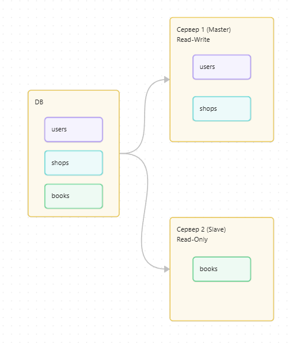
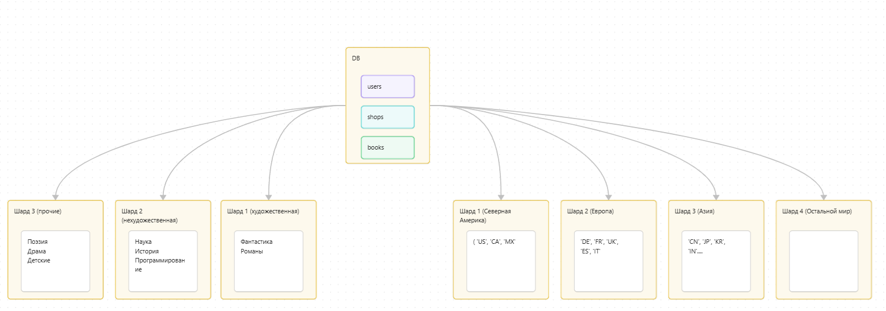

# Домашнее задание к занятию «Репликация и масштабирование. Часть 2» - Фастовец Александр

### Задание 1

Опишите основные преимущества использования масштабирования методами:

-активный master-сервер и пассивный репликационный slave-сервер;
-master-сервер и несколько slave-серверов;

### Ответ

1. **Активный Master-сервер и пассивный репликационный Slave-сервер**
Это классическая архитектура с одним ведущим (master) и одним ведомым (slave) сервером. Данные постоянно копируются (реплицируются) с master на slave.
Основные преимущества:
**Повышенная отказоустойчивость и надежность:**
Аварийное восстановление: Если master-сервер выходит из строя (аппаратный сбой, сетевые проблемы и т.д.), slave-сервер можно быстро перевести в режим master (процедура "failover"). Это минимизирует простои и обеспечивает доступность данных.
Резервное копирование без простоя: Резервные копии базы данных можно создавать с slave-сервера, не создавая нагрузки на основной master-сервер и не прерывая его работу для пользователей.
-**Разделение нагрузки по типу операций:**
Master-сервер занимается исключительно записями (INSERT, UPDATE, DELETE) и критически важными операциями.
Slave-сервер берет на себя всю нагрузку от чтения данных (SELECT-запросы). Это позволяет разгрузить master, повысив его производительность и отзывчивость для операций изменения данных.
-**Простота и низкая стоимость:**
По сравнению с более сложными кластерными решениями, эта архитектура относительно проста в настройке и обслуживании.
Она требует всего одного дополнительного сервера, что делает ее экономически эффективной для многих проектов.
-**Географическое распределение (опционально):**
Slave-сервер можно разместить в другом дата-центре. Это может служить для защиты от сбоев в основном ЦОД, а также для уменьшения задержки для пользователей в другом регионе, если они в основном читают данные.

3. **Master-сервер и несколько Slave-серверов**
Это эволюция первой схемы, где один master-сервер реплицирует данные на множество slave-серверов.
Основные преимущества (включая все преимущества первой схемы, но усиленные):
-**Мощное горизонтальное масштабирование чтения:**
Это ключевое преимущество. Нагрузку от запросов на чтение можно распределить по нескольким slave-серверам. Чем больше slave'ов, тем больше одновременных SELECT-запросов может обработать система. Это идеально для сценариев с высокой нагрузкой на чтение (например, сайты с большим трафиком, аналитические отчеты).
-**Еще более высокая отказоустойчивость:**
При выходе из строя одного slave-сервера, другие продолжают работать. Система балансировки нагрузки просто перенаправляет запросы на чтение на оставшиеся рабочие slave-серверы. Система в целом становится более устойчивой к сбоям.
-**Гибкость в использовании ресурсов:**
Разные slave-серверы можно специализировать под разные задачи:
Для приложения: Один или несколько slave'ов обслуживают основные запросы веб-приложения.
Для аналитики и отчетности: Отдельный slave-сервер можно выделить для выполнения тяжелых и долгих аналитических запросов, которые не будут мешать работе основного приложения.
 Для резервного копирования: Резервные копии можно создавать с отдельного slave, не влияя ни на master, ни на slave'ы, обслуживающие приложение.
-**Улучшенная производительность при развёртывание в нескольких географических регионах:**
Slave-серверы можно размещать в разных регионах мира. Пользователи из Азии, Европы и Америки будут читать данные с ближайшего к ним slave-сервера, что значительно снизит задержку.
-**Сравнение в двух словах:**
Один Master + Один Slave — это отличное решение для повышения надежности и базового разделения нагрузки "чтение vs запись". Это первый шаг в масштабировании.
Один Master + Несколько Slave'ов — это следующий уровень, ориентированный на масштабирование под очень высокие нагрузки на чтение и создание отказоустойчивой системы с избыточностью.

### Задание 2
Задание 2

Разработайте план для выполнения горизонтального и вертикального шаринга базы данных. База данных состоит из трёх таблиц:

    пользователи,
    книги,
    магазины (столбцы произвольно).

Опишите принципы построения системы и их разграничение или разбивку между базами данных.


### Ответ 
Перед проектированием шардинга необходимо понять, какие данные и как будут использоваться.

База данных состоит из следующих таблиц:

Пользователи (users)

Столбцы : ```user_id```, ```email```, ```name```, ```registration_date```, ```country_code```, ```city```.
> Очень частые операции записи (регистрация, обновление профиля). Частые операции чтения (логин, просмотр профиля). Распределение пользователей по странам/городам часто неравномерное.

Книги (books)

Столбцы : ```book_id```, ```title```, ```author_id```, ```genre```, ```published_year```, ```price```.
> Относительно редкие операции записи (добавление новой книги). Очень частые операции чтения (поиск, просмотр каталога, фильтрация). Данные относительно статичны.

Магазины (shops)

Столбцы: ```shop_id```, ```name```, ```location```, ```manager_id```.
> Очень редкие операции записи (добавление/закрытие магазина). Частые операции чтения (привязка заказов, просмотр информации). Данные очень статичны.

### План постороения вертикального шардинга.

Принцип: Разделение таблиц по функциональности между разными серверами.

- Сервер 1 (Master)
   - users (основные данные пользователей)
   - shops (информация о магазинах)
   - Режим: Read-Write (записи и чтение)
     
Тип рабочей нагрузки: Write-Intensive (нагрузка, ориентированная на запись). Частые операции INSERT (регистрация), UPDATE (изменение профиля, данных магазина). Требования к согласованности: Высокие. Нельзя допустить, чтобы пользователь изменил пароль, а система продолжила пускать его со старым. На этом сервере можно настроить индексы, кэширование и параметры сервера именно под интенсивную нагрузку на запись, не мешая операциям чтения из каталога книг. Легко поддерживать ссылочную целостность между users и shops. Можно строже ограничить доступ к критическим пользовательским данным.
   
- Сервер 2 (Slave)
   - books (каталог книг)
   - Режим: Read-Only (масштабирование чтения)
 
Тип рабочей нагрузки: Read-Intensive (нагрузка, ориентированная на чтение). Преобладают операции SELECT (поиск, фильтрация, просмотр). Требования к согласованности могут быть более слабыми ( eventual consistency ). Небольшая задержка (несколько секунд или минут) между добавлением новой книги и ее появлением в поиске приемлема. Этот сервер можно очень легко масштабировать. Можно создать несколько реплик (Slaves) сервера 2 и распределять между ними читающие запросы с помощью балансировщика нагрузки. Это значительно увеличит пропускную способность для поиска и каталога. Высокая нагрузка на каталог книг (например, во время распродажи) не повлияет на критически важные процессы регистрации пользователей или оформления заказов.




### План постороения горизонтального шардинга.

Принцип: Разделение одной таблицы на части (шарды) по определённому ключу. Очень важно выбрать правильный ключ

1. Пользователи (users)
Ключ шардирования: country_code (код страны)

- Схема:
   - Шард 1 (Северная Америка): users WHERE country_code IN ('US', 'CA', 'MX')
   - Шард 2 (Европа): users WHERE country_code IN ('DE', 'FR', 'UK', 'ES', 'IT', ...)
   - Шард 3 (Азия): users WHERE country_code IN ('CN', 'JP', 'KR', 'IN', ...)
   - Шард N (Остальной мир): Для всех остальных стран. Можно объединять в регионы.

Обоснование:
1. Географическая локализация: Большинство запросов к данным пользователя (логин, просмотр профиля) происходят в рамках одной страны или региона. Это гарантирует, что эти запросы будут обрабатываться только одним шардом, что минимизирует задержки.
2. Юридическое соответствие: Упрощает соблюдение законов о данных (как GDPR), так как данные пользователей из определенных юрисдикций физически находятся на выделенных серверах.
3. Эффективное масштабирование: Позволяет добавлять шарды для новых быстрорастущих регионов или для стран с огромной пользовательской базой (например, выделить отдельный шард для пользователей из Индии). Проблема неравномерного распределения решается на уровне шардов, а не отдельных записей.

2. Книги (books)
Ключ шардирования: genre (жанр) или author_id

- Схема (на примере genre):
   - Шард 1 (Художественная лит.): books WHERE genre IN ('Фантастика', 'Фэнтези', 'Роман')
   - Шард 2 (Нехудожественная лит.): books WHERE genre IN ('Наука', 'История', 'Биография', 'Программирование')
   - Шард 3 (Прочее): books WHERE genre IN ('Поэзия', 'Драма', 'Детские', 'Комиксы')

Обоснование:
1. Паттерны доступа: Пользователи чаще всего ищут и просматривают книги в рамках определенного жанра или автора. Шардирование по жанру группирует данные, которые запрашиваются вместе, на одном шарде.
2. Распределение нагрузки: Равномерно распределяет нагрузку от чтения между шардами. Запрос на подборку книг в жанре "Фэнтези" будет выполняться целиком на одном сервере, а не сканировать все серверы кластера.
3. Управление ростом: Разные жанры могут иметь разный объем данных (например, научной литературы может быть меньше, чем романов). Это позволяет масштабировать каждый жанр по отдельности based on its size.

>3. Магазины (shops)
>Горизонтальное шардирование не требуется.

Обоснование:
1. Небольшой объем: Таблица справочной информации. Даже у крупнейших сетей количество магазинов исчисляется тысячами, а не миллионами. Это легко помещается в оперативную память одного сервера БД.
2. Статичность: Данные изменяются крайне редко. Нет нагрузки на запись, которая требовала бы распределения.
3. Частое чтение: К этой таблице будут часто обращаться как к справочнику. Размещение ее в виде единственной реплики (или с несколькими read-only репликами для отказоустойчивости) обеспечит максимальную производительность, так как все запросы будут идти к одному месту без необходимости сбора данных с разных шардов.


 


Такой подход позволит создать гибкую и масштабируемую систему, способную эффективно обрабатывать растущую нагрузку при сохранении высокой производительности и надёжности.
